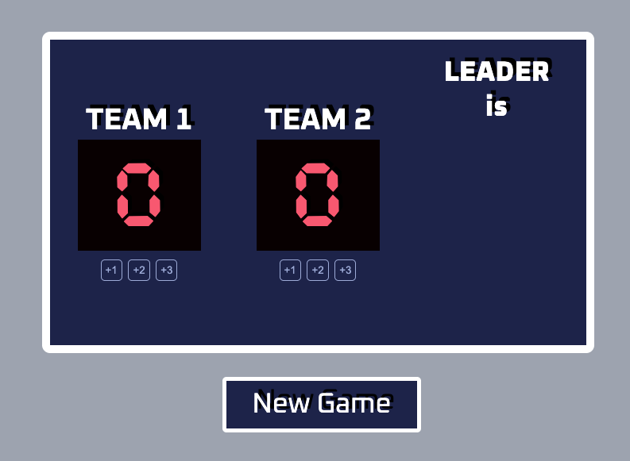

# 🏀 Basketball Scoreboard

A solo implementation of a Figma design challenge built using HTML, CSS, and Vanilla JavaScript to practice DOM manipulation and event handling.

The application allows users to update scores for two basketball teams while demonstrating core JavaScript concepts such as variables, functions, DOM manipulation, and event handling.

---

## 📸 Preview

---

## ✨ Features

- Home and Guest scoreboards
- Add 1, 2, or 3 points
- Reset scores
- Automatically highlights the team in the lead
- Instant score updates using JavaScript
- Pixel-style basketball scoreboard UI
- Responsive layout
- Built from a Figma design

---

## 💡 JavaScript Concepts Used

- Variables
- Functions
- Event handling
- DOM manipulation
- `document.getElementById()`
- Updating `textContent`
- Conditional statements (`if...else`)

---

## 📚 What I Learned

While building this project, I practiced:

- Connecting JavaScript with HTML
- Manipulating the DOM dynamically
- Handling button click events
- Updating UI based on user interaction
- Structuring JavaScript into reusable functions
- Translating a Figma design into a working web application

---

## 🎯 Project Goal

The objective of this project was to recreate the provided Figma design while learning JavaScript fundamentals by building an interactive scoreboard application.

---

## 👨‍💻 Author

**Ashish Bargaje**

- GitHub: https://github.com/ashishbargaje
- LinkedIn: https://www.linkedin.com/in/ashish-bargaje/
